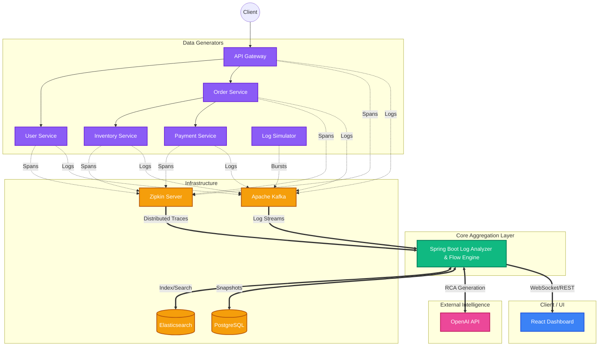

# TeamRio: AI Log Analyzer & API Flow Visualizer

A production-grade observability platform designed to automatically analyze application logs, trace distributed API flows, detect anomalies/bottlenecks, and generate AI-powered actionable remediation guidance.

   

## 🌟 Key Features

- **Distributed Trace Visualization**: Interactive React Flow graphs showing service-to-service API call flows, latency metrics, and error rates (powered by Zipkin).
- **Automated Log Analysis**: Ingests logs via Kafka, applies deterministic normalization, and clusters errors by stack trace signatures.
- **Real-Time Dashboards**: WebSockets (STOMP/SockJS) integrate the frontend and backend for real-time visualization of anomalies and log streams.
- **Anomaly & Bottleneck Detection**: Automatically identifies error bursts, high-latency nodes, cascading failures, and high fan-out topologies.
- **AI-Powered Root Cause Analysis (RCA)**: Uses Spring AI + OpenAI to analyze bottlenecks, API flow behavior, and incidents, providing automated plain-English explanations and fix actions.
- **Microservices Demo Environment**: Includes a fully functional e-commerce microservices environment (with built-in chaos engineering) to generate real traces and test the system.

---

## 🏗️ System Design Architecture

TeamRio acts as an aggregator and intelligent analysis layer sitting on top of standard observability infrastructure (like Kafka and Zipkin).

### High-Level Components

- **Frontend Dashboard (React 19 / Vite)**: Provides real-time insights, interactive API flow graphs (leveraging React Flow with custom hierarchical layouts), and detailed bottleneck views.
- **Analyzer Backend (Spring Boot / Java 21)**: The core engine. It ingests logs from Kafka, fetches traces from Zipkin, runs bottleneck detection algorithms, and orchestrates calls to the LLM for RCA.
- **Infrastructure**: Apache Kafka (message ingestion), Elasticsearch (log indexing/search), PostgreSQL (persistent relational data and graph snapshots), and Zipkin (trace collection).
- **Demo Services / Simulators**: Built-in simulators and a microservices cluster designed to generate realistic synthetic telemetry for the platform.

### Architecture Diagram



### Flow processing pipeline

1. **Ingestion**: Zipkin APIs collect raw trace spans.
2. **Graph Construction**: The backend `FlowGraphBuilder` parses span parent-child relationships and transforms them into domain structures (`ServiceNode`, `API FlowGraph`).
3. **Bottleneck Detection**: `BottleneckDetector` evaluates metrics like node latency, fan-out, and error cascading to pinpoint bottlenecks.
4. **AI RCA**: `AiFlowExplanationService` generates conversational, natural-language fixes based on identified system bottlenecks.
5. **Visualization**: Frontend graphs represent the topology interactively via React Flow.

---

## 🏗️ Project Structure

- **`log-analyzer-service/`**: Core Java 21 / Spring Boot backend. Ingests logs, processes Zipkin traces, analyzes data, and provides REST APIs.
- **`dashboard/`**: React 19 + Vite frontend application. Features real-time dashboards and the interactive API Flow Visualizer.
- **`microservices-demo/`**: A realistic sample e-commerce microservices environment (Gateway, User, Order, Inventory, Payment) to generate distributed traces.
- **`log-producer-simulator/`**: A lightweight utility to generate synthetic log traffic to Kafka.
- **`docker/`**: Infrastructure configuration (Kafka, Zookeeper, Elasticsearch, PostgreSQL).
- **`setup_and_run.sh`**: One-click script to build and launch both the backend analyzer and frontend dashboard.

---

## 🚀 Getting Started

### Prerequisites

- **Java**: JDK 21
- **Node.js**: v18+ (for frontend UI)
- **Docker & Docker Compose**
- **Maven**: 3.8+
- **OpenAI API Key**: Required for the AI-powered RCA features.

### 1. Start Core Infrastructure

Start Kafka, Elasticsearch, and PostgreSQL using Docker Compose. 
*Note: Kafka is configured to run on external port `9093` to avoid conflicts.*

```bash
docker compose -f docker/docker-compose.yml up -d
```

Start the Zipkin server for distributed tracing:
```bash
docker run -d --name zipkin -p 9411:9411 openzipkin/zipkin
```

### 2. Export API Key (Optional but recommended)

To enable AI Root Cause Analysis features, export your OpenAI API key:

```bash
export OPENAI_API_KEY="sk-your-openai-api-key"
```

### 3. Build and Run the Platform

We provide a convenient script to build the backend, install frontend dependencies, and launch both services simultaneously:

```bash
chmod +x setup_and_run.sh
./setup_and_run.sh
```

- **Dashboard (Frontend)**: [http://localhost:5173](http://localhost:5173)
- **Analyzer (Backend API)**: [http://localhost:8090](http://localhost:8090)
- **Zipkin UI**: [http://localhost:9411](http://localhost:9411)

---

## 🚦 Generating Test Data

To see the platform in action, you can generate logs and traces using two provided tools:

### Option A: Generate Distributed Traces (API Flow Visualizer)

Spin up the included `microservices-demo` to generate real Zipkin traces. It simulates an e-commerce flow with optional chaos engineering.

1. Navigate to the demo directory:
   ```bash
   cd microservices-demo
   ```
2. Start the microservices:
   ```bash
   # You can run via docker-compose
   docker-compose up --build -d
   ```
3. Generate traffic:
   ```bash
   ./demo.sh http://localhost:8081 10 2
   ```
   *(This script creates 10 orders with a 2-second delay between requests).*

Navigate to **http://localhost:5173/flows** to see the interactive flow visualization!

### Option B: Generate Plain Logs

To generate synthetic log bursts directly to Kafka:

```bash
cd log-producer-simulator
mvn clean install -DskipTests
java -jar target/log-producer-simulator-0.0.1-SNAPSHOT.jar
```

---

## 🛠 Troubleshooting

- **No Docker Compose file found in directory**: 
  The Spring Boot app uses `spring.docker.compose.enabled=false`. Ensure you manually start the infrastructure via the provided `docker/docker-compose.yml`.
- **Dagre ESM Compatibility / React Flow**: 
  The frontend uses a custom hierarchical layout algorithm for graph rendering instead of `@dagrejs/dagre` to ensure broader ESM compatibility.
- **Port Conflicts**:
  If the backend or frontend fails to start, verify that ports `8090` (backend), `5173` (frontend), `9411` (Zipkin), and `9093` (Kafka) are free.

---

## 📝 License

Internal Project - TeamRio
